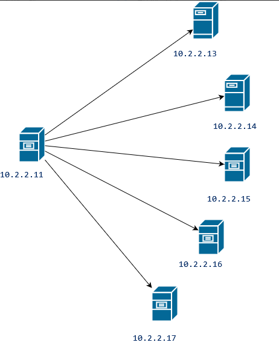
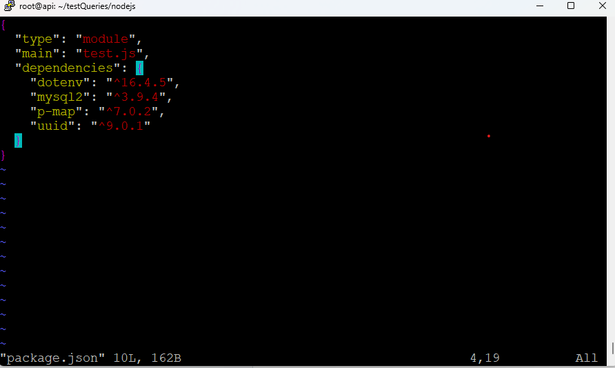
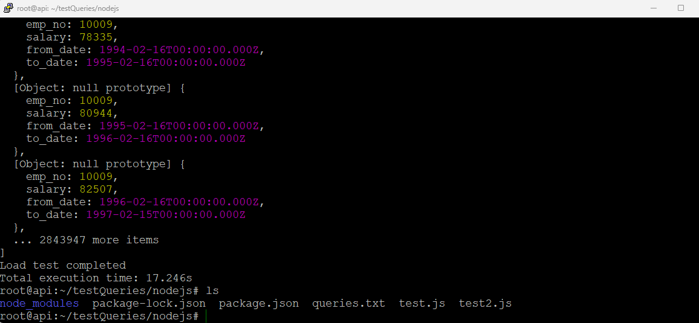
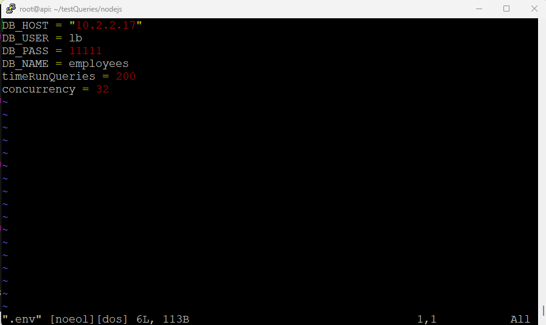
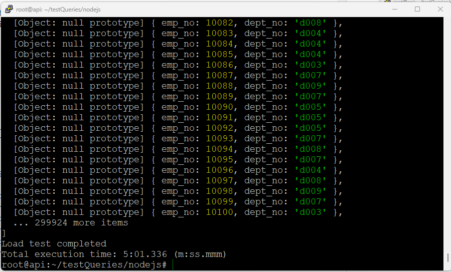
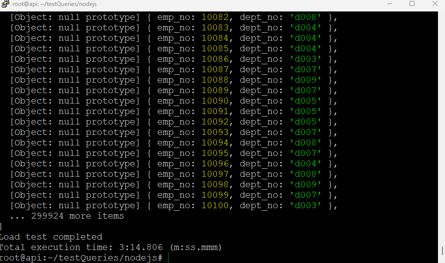

# Distributed system report,.
## 1. System architecture. 

* The server 10.2.2.11 will be the server that send queries to 5 other servers in the network.

* Servers that have IP address 10.2.2.13-17 store the same database.
## 2. The guideline to build and run the test for sql servers.
## Node.js environment setup.
### **Download Node.js on Ubuntu 22.04.4 LTS:**

```
#Installs nvm (node version manager)  
curl -o- https://raw.githubusercontent.com/nvm-sh/nvm/v0.39.7/install.sh | bash

#Download and install node.js  
nvm install 21

#verifies the right node.js version is in the environment  
node -v # should print "v21.7.3"

#verifies the right npm version is in the environment  
npm -v # should print "10.5.0"
```

### **Guideline to run script.**
1. Create a folder named testQueries.
```
mkdir demo 
cd demo  
```
2. Clone this Github repository: [](https://github.com/Tay-Tao-To/distributedSystem/tree/main/testQueries) .
3. Stand at the current folder run ` npm i ` it will install all necessary package for the project .



4. Run command ` node --max-old-space-size=4096 test1.js ` to test the performance of the program in multithreading way without any load-balancer.
5. Run command ` node --max-old-space-size=4096 test2.js ` to test the performance of the program in multithreading way with the load-balancer using Round Robin algorithm.
6. Run command ` node --max-old-space-size=4096 test3.js ` to test the performance of the program in multithreading way without the load-balancer using Least Connection algorithm.


## 3. Explain about the scripts.

* This script will run the queries in a queries.txt file concurrently and then log out how log it takes to run all the queries.



* Here I let the script run all the queries one time and there are 2 queries will be started at the same time

```
async function loadTest(queries) {
    const queriesArray = new Array(1).fill(queries).flat(); // Flatten the array
    await pMap(queriesArray, query => executeQuery(query), { concurrency: 2 }); // Reduce concurrency
    console.log('Load test completed');
}
```
* Here is the queries in the queries.txt file:
```
-- Query 1: Get all employees with their department numbers from the current_dept_emp table
SELECT emp_no, dept_no FROM current_dept_emp;
```
* The function that implement load balancer, the mechanic here is that the function will return the pool that has the least connections:
```
function getLeastConnectionPool() {
    // Sort the pools by the number of active connections and select the one with the least connections
    return pools.sort((a, b) => a.activeConnections - b.activeConnections)[0];
}
```

## 4. The scenario.

### All the scripts will run the queries in the queries.txt file 200 times and they can excecute 32 queries at the same time. 



* Run script test1.js will have the result as following: 



* Run script test2.js will have the result as following:



==> The result show that the time it do the same amount of queries. 